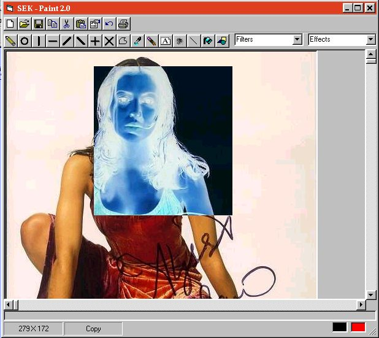



## SEK Paint 2\.0

### Description

This is the second version of my award-winning Painting-Tool. It has a Toolbox, some new filters and faster effects!
 
### More Info
 
You can pass the path to a picture in the commandline!

I think you must have installed VB 6.0 or any other language from Visual Studio 6.0. This is because of the Common Dialog Control and the ImageList Controls.

             |
---                |---
**Submitted On**   |2000-07-09 10:04:56
**By**             |[Stephan Kirchmaier](https://github.com/Planet-Source-Code/PSCIndex/blob/master/ByAuthor/stephan-kirchmaier.md)
**Level**          |Advanced
**User Rating**    |4.9 (84 globes from 17 users)
**Compatibility**  |VB 3\.0, VB 4\.0 \(16\-bit\), VB 4\.0 \(32\-bit\), VB 5\.0, VB 6\.0, VB Script, ASP \(Active Server Pages\) 
**Category**       |[Complete Applications](https://github.com/Planet-Source-Code/PSCIndex/blob/master/ByCategory/complete-applications__1-27.md)
**World**          |[Visual Basic](https://github.com/Planet-Source-Code/PSCIndex/blob/master/ByWorld/visual-basic.md)
**Archive File**   |[CODE\_UPLOAD7553792000\.zip](https://github.com/Planet-Source-Code/stephan-kirchmaier-sek-paint-2-0__1-9616/archive/master.zip)

### API Declarations

see code and vote 4 me, pls.

